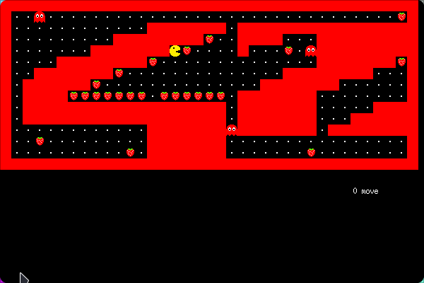

# Mini-Pacman game

A top-down adventure game where you navigate a maze collecting items and avoiding enemies.

## Introduction

This project implements a classic top-down adventure game called "Pacman". You play as an adventurer trapped in a maze and must collect all collectibles before reaching the exit. However, be wary of the ghosts that roam the maze!

The program first validates the map and will give an error if: 

    - The map is not surrounded by walls
    - There are no collectable in the map
    - Not all collectables can be reached
    - The exit can not be reached

## Features

Top-down movement
Collectible items
Exit door
Enemy ghosts
Optional ghost count for difficulty adjustment

## Dependencies

This project relies on the minilibx library (Linux-specific). Installation instructions can be found here: link to minilibx installation instructions
Installation

## Prerequisites:

- A C compiler (GCC)
- make build tool

## Build Instructions:

### Clone this repository:

`git clone https://github.com/<your-username>/so_long.git`

### Navigate to the project directory:
`cd so_long`

### Build the project:
`make`

## Usage

To run the game after compiling, execute the following command:

`./so_long <map_name> <optional_ghost_count>`

`<map_name>`: Replace this with the name of the map file located in the maps directory (e.g., map01.ber). There are several maps that can be used in maps folder.

`<optional_ghost_count> `(optional): This is an optional parameter to adjust the difficulty. Enter a number for the desired number of ghosts in the maze. If omitted, a default number of ghosts will be used.

### Example:

`./so_long map01.ber 3  # Play map01.ber with 3 ghosts`

## Controls:

Use the keys (w, a, s, d) to move your character.

ESC key will exit the program.

## Objective:

Collect all the collectibles in the maze and reach the exit door. Avoid contact with the ghosts!

## License

This project is distributed under the MIT License. See the LICENSE file for details.

## Contact

If you have any questions or feedback, feel free to create an issue on this repository.